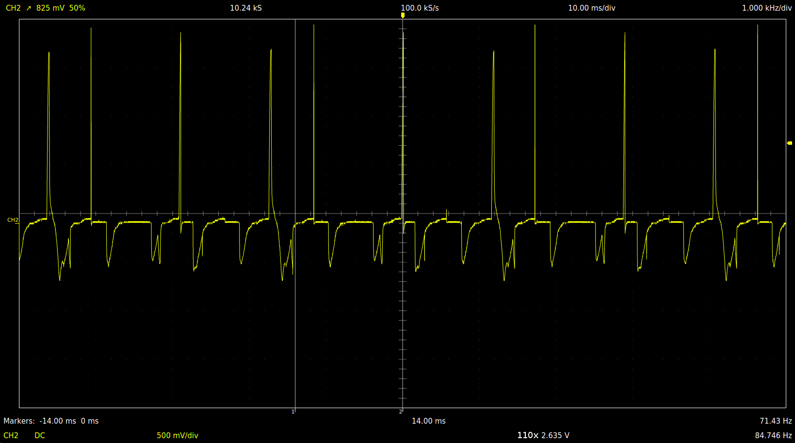

The goal of this project is to build a tool to test Ducati DCDI modules on the bench and understand how they work.
The work is split into several steps:
 - trying to infer something from the manual
 - in-place measurements on the running engine
 - experiments with the module on the bench

# Understanding what to expect from the charging coils

According to the manual, stator has 10 poles, 8 of which are allocated for alternator and remaining two are independent charging coils supplying power to each DCDI module.

Rotax heavy maintenance manual specifies the resistance of the charging coils as low as 4.5 ohm. It feels too low to be able to deliver a couple of hundred volts rms required to charge CDI capacitor over the whole range of RPM settings. Therefore we should expect some sort of a voltage booster logic to be implemented inside the modules.

# On the running engine

## Unloaded tests

Unloaded measurements were performed on disconnected coils while running the engine on a single magneto.

### Charging coil

Voltage frequency is a crankshaft rotations per second multiplied by 5.
This is due to 10 magnetic poles on the rotor with a full voltage period requiring 2 poles to pass over the charging coil.

#### @ 3210.0 RPM

~212v peak-to-peak

#### @ 2345 RPM

~150v peak-to-peak. This is about 53v rms for a sine wave and probably sligly less for the observed signal shape. Definitely not enough to charge CDI capacitor directly.

### Trigger coil @ 2106 RPM

## Loaded tests

### Charging coil

#### Incomplete charge cycle

In order to boost the charging voltage, the module shortens about the first half of the positive half-period of the wave to the ground. When the current reaches it's maximum, module releases all stored in the coil energy into the capacitor. It works like a boost converter with the stator coil acting as an inductor.

#### Finished charge cycle

Charging voltage is limited by a threshold (~200v). When it is reached, the coil is again shortened to the ground to prevent capacitor overcharge.

#### Zoom out view of a couple of cycles

On this image it is quite easy to see incomplete charge cycles (threshold not reached) and it is even possible to guess when capacitor was discharged and the spark generated.

# On the bench

## DC test

12v DC through 24v light bulb and a secondary winding of a 220v to 24v transformer.

## Bench generator test

