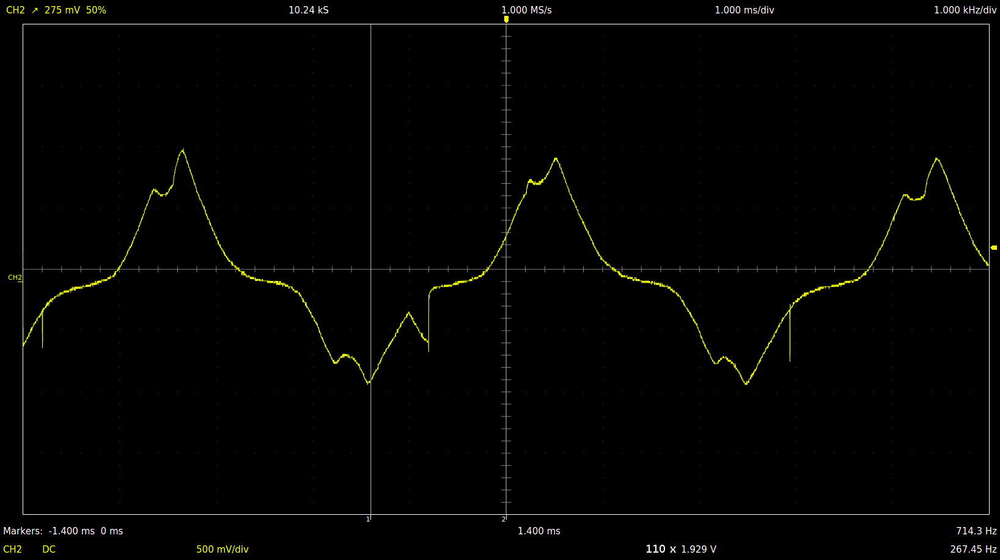
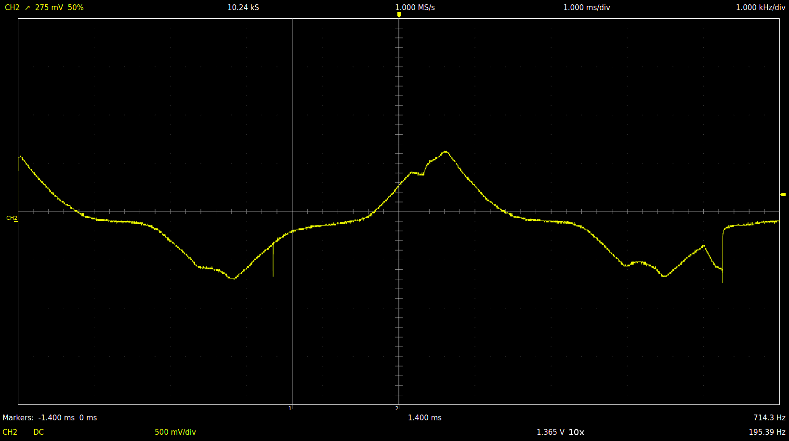
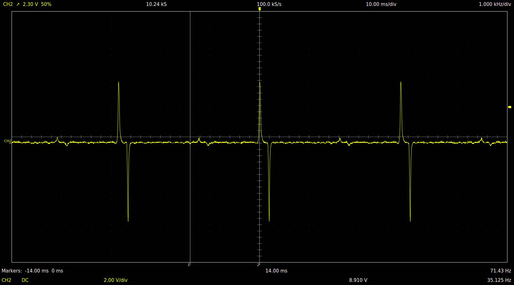
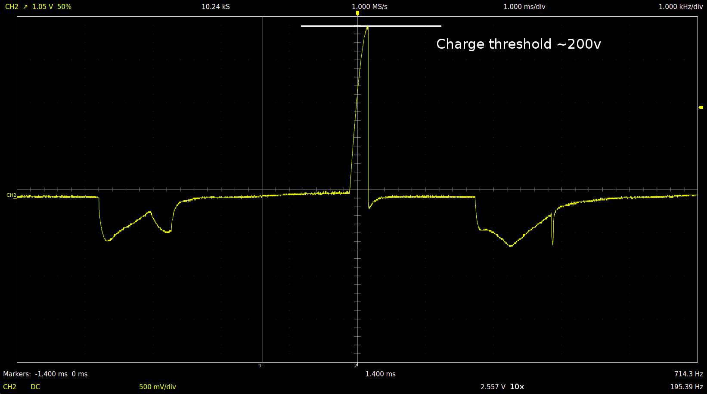
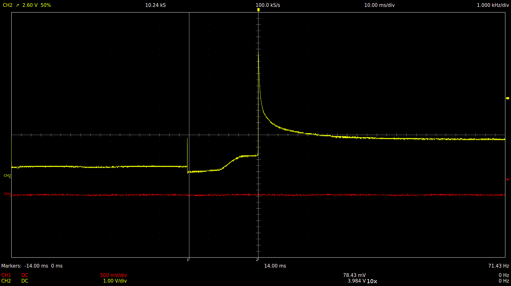
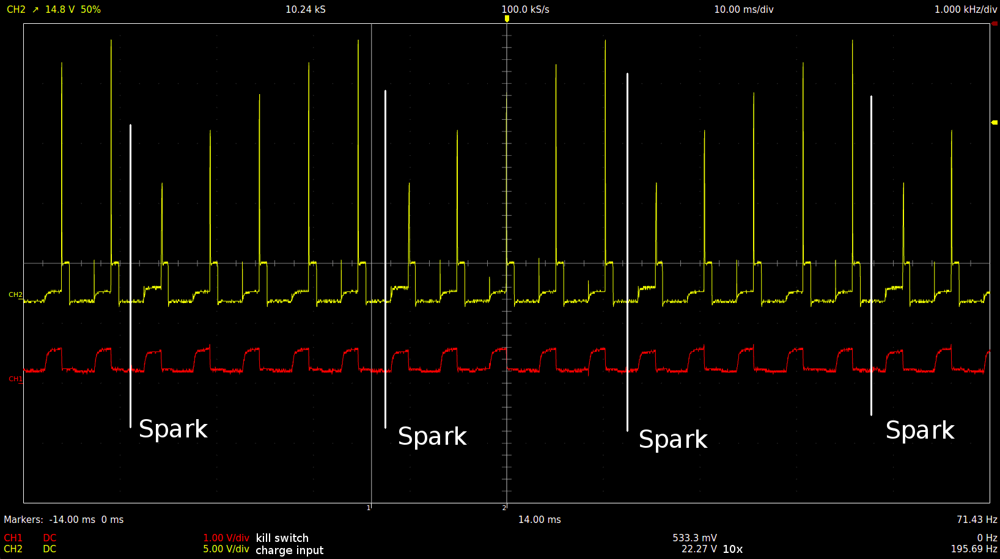

# On the running engine

## Unloaded tests

### Charging coil

#### @ 3210.0 RPM

#### @ 2345 RPM

### Trigger coil @ 2106 RPM

## Loaded tests

### Charging coil

#### Incomplete charge cycle

#### Finished charge cycle

# On the bench

## DC test

12v through 24v lightbulb and a secondary winding of a 220v to 24v transformer.

## Bench generator test

